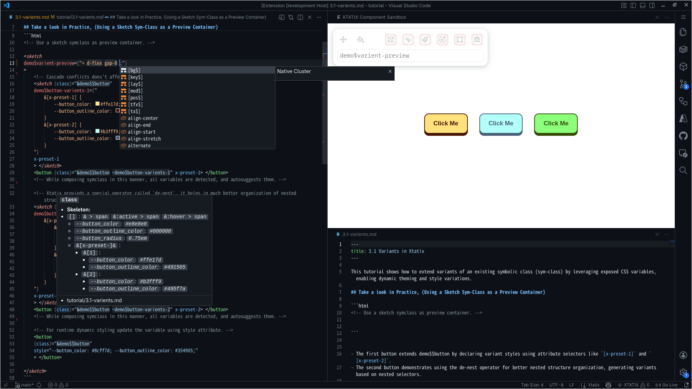

# 0.0 Alchira Plugin

The extension connects to language servers in this fallback order:

- Locally installed in the workspace directory
- Globally installed on the system
- Built-in language instance bundled with the extension

In `./alchira/configure.jsonc` | `environment`, determines the css completion provider in composition blocks.
	
## Status bar Widget

- Hover to find Sketchpad-Url.
- Click on widget to see essential links and and Cli commands.
- Displays if focused editor file is being watched and error count.

> Run `Preview` or `Debug`, command from widget palttte before proceeding further.

## Practice Element

Use this code block as your workspace to try out features.

```html
<sketch 
demo$button="
	+ tx$weight-600 border-none cursor-pointer;
	--button_radius: 0.75em;
	--button_color: #e8e8e8;
	--button_outline_color: #000000;
	font-size: 16px;
	border-radius: var(--button_radius);
	background: var(--button_outline_color);
	& > span {
		+ tfx$duration-100 d-flex px-6 py-4 mod$-translate-y-6;
		box-sizing: border-box;
		border: 2px solid var(--button_outline_color);
		border-radius: var(--button_radius);
		background: var(--button_color);
		color: var(--button_outline_color);
	}
	&:hover > span {
		+ mod$-translate-y-8;
	}
	&:active > span {
		+ mod$translate-y-0;
	}
	&[x-preset-]& {
		&[1] {
			--button_color: #ffe17d;
			--button_outline_color: #491505;
		}
		&[2] {
			--button_color: #b3fff9;
			--button_outline_color: #495f7a;
		}
	}
"
x-preset-1
>	<span> Click Me </span> </sketch>

<button class="~demo$button">
</button>

```
Inspiration: https://uiverse.io/Voxybuns/lucky-fireant-71

## Shortcuts

### Sketchpad: `[ ctrl + alt + x ]`

- Put cursor on a symlink here `\~demo$button` instance and trigger event.
- Change attribute `x-preset-1` to `x-preset-2`, to observe live udpates.
- In the sketchpad webview panal few tools are available try out those.

### Formating: `[ alt + shift + x ]`

- The extension formats Alchira-Composition Blocks in the focused file on first trigger.
- Subsequent triggers toggle the nearest folding range across the entire file, not just composition blocks.

### Source/Target Switch: `[ ctrl + alt + shift + x ]`

- Toggle between files in the source and target directories with a one-to-one mapping.
- This feature will not work for `*.alchira` files, given the fact compilation doesnot produce source files.

### Template Import: `[ alt + x ]`

- Import available templates for the symlink at the active cursor position, appending them to the current HTML tag.
- In practice: Change `class=""` to `class="~demo$button"`, hover over preferred symlink and trigger the event, the template snippet imports after the current tag scope.
- This is especially useful for complex, highly structured compound components, allowing you to build and iterate from there

### Goto Source: `[ F12 ]` / `[ ctrl + (left-click over symlink) ]`

- Redirects to location of declaration.

## Language support

- Files of extensions `.alchira` is treated as markdown.
- Support for `@--attach` and `@--assign` directives css files.
- Tooltips with information, on watching attributes, symbolic classes and hashrules.
- Block recognitions, folding range detection, color pallete and syntax highliting for Alchira Composition blocks.
- Color picker palettes: `rgb`, `rgba`, `hsl`, `hsla`, `lch`, `oklch`, `lab`, `oklab`, `hex`

### Developer Assistance

## Real-time diagnostics.

- Declararion collition of symlinks as errors.
- Invalid use of hashrules as warnings.

## Intellisense and autocomplete.

- Symbolc classes: Across file on valid trigger.
- Hashrules: on `&` or `#`(have a chance to not get triggered in case of collition with other extensions), for tag attributes.
- Variables: Resolved from complete active tag-scope.
- Attributes: Varient attributes derived from tag-scope.
# 0.1 Thinking with AL

Alchira treats HTML and CSS as one language: you describe *what the UI is* and *how it should look* in the same place. The compiler handles selectors, cascade, and CSS output automatically.

### Start from structure, not selectors

- Model pages as sketches and regions (card, header, layout) instead of loose DOM nodes styled later.
- Each sketch has a unique symlink—a symbolic handle used for both styling and preview.
- Because structure and style share the same symclass, the editor can instantly render or navigate to any sketch.
- Each block owns its markup and styles, so you design by meaning, not selectors.
- Small or one‑off pieces can be written inline without a sketch.

```html
<sketch global$symlink="/* styles */">
  <h1>Heading</h1>
  <button global$$button-1="--var: val;">Submit</button>
</sketch>
```

### Declare visual intent, not mechanics

- Sketches speed up early prototyping—perfect for quick layout and preview.
- For throwaway UIs, reuse utilities; for reusable parts, define spacing, alignment, and type directly on the sketch.
- When stable, export the sketch into your framework and connect logic there.
 
### Composition over cascade

- Build with composition of sketches and symclasses, not global CSS selectors.
- Variants, themes, and responsive modes are explicit properties or nested blocks—local, predictable, and free of cascade traps.

### The language is the design system

- Colors, spacing, and type tokens are first‑class language concepts.
- Global tokens (prefix `---`) live in `alchira/#constants.css`.
- Local `--` variables act as live, mutable style handles shown in IntelliSense.
- Hovering on `\~global$$button-1` will show which handles can be safely tweaked.  
- Editing a token or symclass safely refactors every dependent component.

### Mental model shift

| Factor | Traditional HTML + CSS | With Alchira |
| --- | --- | --- |
| Context switching | Jumping across templates, CSS, and token files. | One unified artifact—less cognitive friction. |
| Components | Enforced by naming and conventions. | Native in language—composition and reuse are built in. |
| Design tokens | Split across files and tools. | Centralized and semantic—changes propagate safely. |
| Refactoring | Manual, error‑prone cleanup. | Compiler regenerates optimized CSS automatically. |
| Tool Leverage | Generic, name‑based linting. | Smarter IDE features—live previews, rule validation, token introspection. |
# 0.2 Command Line

### `init` : Initialize and Healthcheck

- Sets up the project by importing the configuration folder.
- `init {flavor}` uses an installed flavor to map the environment and bootstrap the project.
- You should makes necessary changes to `configure.jsonc`, according to your preferences.
- Running init again in an initialized directory creates any missing sub-folders and performs a setup health check.

### `debug` : Compiles with full verbosity and traceability

- Verbose output with traceable class-names and properties.
- Larger output size.

### `preview` : Optimized compilation for lightweight builds:

- One-to-one compilation.
- Minified Css Output

### `watch` : Preview Command in Continuous Watch Mode:

- Same results as preview output, but with continuous compilation.
- Start an instance along with dev-enviornments build command.

## Developer Commands

### `server` : Starts language server

- Helps in active language assistance in editors.
- Start server, use `help` for available command list.
- Used by extension developers at build time and editor clients at runtime.

### `void` : Void run, no execution.

- For checking validity of binary without any side effects.
# 0.3 Directory

## Setup folder
```
    alchira/
    ├── #at-rules.css      # Preface stylesheet directives for final stylesheet.
    ├── #constants.css     # Global design tokens, starts with `---`.
    ├── #elements.css      # Sematic tag style definitions.
    ├── #extends.css       # Miscellanious declarations and overrides.
    ├── configure.jsonc    # Project configs for reference.
    ├── hashrules.jsonc    # Standerdize wrapper chains for reuse.
    ├── vendors.jsonc      # Vendor provider data for final stylesheet.
    └── libraries          # Reusable style Symlinks (class equilents generator) 
          ├── *.css        # Additional custom definitions
          └── _            # Immutables by flavor provider.
                └── *.css  # Definitions
```

### `./#at-rules.css`
- Defines preface directives for exported stylesheets.
- Declares preface-level directives for exported stylesheets, such as `@import`, `@layer`, `@charset`, `@font-face` etc.

### `./#constants.css`
- Defines the core design tokens—colors, spacing, typography, and themes.
- Constants are context-aware and surfaced via LSP suggestions in valid scopes, enabling consistent styling.

> **Convention:**
> To prevent naming collisions and maintain clarity, all constants should follow the standard prefix format:  **`---{...}`**. This naming convention ensures safe resolution across files and avoids unintended conflicts in symbolic or dynamic contexts
---

### `./#elements.css`
- Encourages semantic usage of tags by styling native tags directly.
- Offers classless CSS that dynamically adapts to the design system defined in `constants.css`, promoting minimal markup and clean semantics.

### `./#extends.css`
- Augments the base CSS with additional declarations and overrides.
- Ideal for post-compilation definitions, utility extensions, and scoped enhancements that build on the compiled source stylesheet.

---
### `./configure.jsonc`

```json
{
  "vendors": "none",
  "proxymap": [
    {
      "source": "source",
      "target": "target",
      "stylesheet": "styles.css",
      "extensions": {
        "html": [
          "class"
        ]
      }
    }
  ],
  "environment": "browser",
}
```

- **`vendors`**  
    Specifies vendor prefixing behavior.  
    Accepts `"none"` or a list of vendor targets (e.g., `"webkit"`, `"moz"`).
- **`proxymap`**  
    Defines proxy compilation behavior for source-to-target transformation.
	- **`source`**  
	    Path to the original source directory containing raw project files.
	- **`target`**  
	    Proxy output directory. Acts as a working compilation target for the source folder.
	- **`stylesheet`**  
	    Stylesheet appended to the final compiled output. Located within the target directory.
	- **`extensions`**  
	    Maps file types to attributes where symbolic classes will be injected.  
	    Example: `"html": ["class"]` targets HTML files and assist merge tooltip via extension for given attributes.
- **`environment`**  
    Used by Editor extention for standerd css completion in compilation blocks.  
    Refer Extention walkthorugh to see in action at [../tutorial/0.extention.md](../tutorial/0.extention.md).

### `./hashrules.jsonc`

```json
{
  "-DesignApproach": "#{-MobileFirst}",
  // Values for #DesignApproach
  "-MobileFirst": "min-width",
  "-DesktopFirst": "max-width",  
  // @media standards
  "Ms4": "media@(#{-DesignApproach}:0320px)",
  "Ms3": "media@(#{-DesignApproach}:0384px)",
  "Ms2": "media@(#{-DesignApproach}:0448px)",
  "Ms1": "media@(#{-DesignApproach}:0512px)",
  "Mmd": "media@(#{-DesignApproach}:0640px)",
  "Ml1": "media@(#{-DesignApproach}:0768px)",
  "Ml2": "media@(#{-DesignApproach}:0896px)",
  "Ml3": "media@(#{-DesignApproach}:1024px)",
  "Ml4": "media@(#{-DesignApproach}:1152px)",
  // @container standards
  "Cs4": "container@(#{-DesignApproach}:160px)",
  "Cs3": "container@(#{-DesignApproach}:192px)",
  "Cs2": "container@(#{-DesignApproach}:224px)",
  "Cs1": "container@(#{-DesignApproach}:256px)",
  "Cmd": "container@(#{-DesignApproach}:320px)",
  "Cl1": "container@(#{-DesignApproach}:384px)",
  "Cl2": "container@(#{-DesignApproach}:449px)",
  "Cl3": "container@(#{-DesignApproach}:512px)",
  "Cl4": "container@(#{-DesignApproach}:576px)",
  // Global States
  "Load": "body[data-loading='true']"
}
```

- `hashrules` define reusable **wrapper-attribute-snippets** as key-value pairs, where keys are restricted to characters: `A–Z`, `a–z`, `0–9`, and `-`.
-  Support **recursive loading**, enabling inheritance across definitions.
- To use a `hashrules` in a script, use the `#{___}` within **wrapper-attribute** of a tag. The `hashrule` will only take effect if the tag already includes a declared style.
- If a recursion loop is detected due to conflicting shorthand definitions, those entries will be ignored during compilation, with errors.

> For clarity and conflict avoidance, any `hashrule` used as a variable should begin with a **`-` prefix**.

### `./vendors.jsonc`

- If `configure.jsonc | vendors: none` : Paste custom vendor data in this file
- If `configure.jsonc | vendors: {url}` has a valid URL source file will by automatically updated occasionally for vendor provider data.

### `./libraries`

- Organize classes into groups with up to 6 levels of inheritance based on existing classes.
- Details on managing libraries are covered in the next section.

### `./libraries/_`

- This folder contains the immutable part of your library supplied by the initalized flavour.
- It includes static class sources used for symlink generation.
# 0.4 Libraries

Composing libraries is essentially like managing a set of CSS files—sensibly grouping classes and naming them according to established standards. This approach ensures clarity, maintainability, and consistency across your stylesheets.

Well-structured grouping and naming conventions help in scalable CSS architecture and make it easier to extend or modify the libraries over time.

## Naming Files
```
{cluster}.{order}.{name}.css
``` 

- **cluster** : `string[A-Z a-z 0-9 -]`
- **order** : `0|1|2`
- **name** : `string[A-Z a-z 0-9 -]`

## Managing Library Files

```
{cluster}{'$'*order}{Normalized(selector)}
```
#### Example

The classes defined in this file are accessed from other files using the following symbolic class references.

```css
/* anim.1.animation.css */

.none {
  transition: none;
} /* Symlink: anim$none */

.all {
  transition: all 300ms ease;
} /* Symlink: anim$all */

.transform {
  transition: transform 300ms ease;
} /* Symlink: anim$transform */

.opacity {
  transition: opacity 300ms ease;
} /* Symlink: anim$opacity */

.fade-in {
  @--attach anim$_keyframes_fade-in;
  animation-name: fade-in;
} /* Symlink: anim$fade-in */

@keyframes fade-in {
  from {
    opacity: 0;
  }

  to {
    opacity: 1;
  }
} /* Symlink: anim$_keyframes_fade-in */
```

All the first order blocks of each file will have a corresponding symbolic class generated. This will be use full in cases where custom rule block has to be linked with classes.

## Special CSS Directives

```css
.classname {
  @--apply $class-1 $class-2 $class-1;
  @--attach $attach-1 $attach-2;
}
```

### `@--apply`
- Compose styles from predefined classes from libraries using symlinks.
- Values derived from this action is overridden by explicit properties

### `@--attach`
- Creates dependency with other classes using its symbolic-class representation.
- Library classes have dependent-style and composable-style of same value.  

## Inheritence Pattern:

- `order` is the hierarchy level for library inheritance. Lower order files provide base/axiom styles; higher order files can reference and extend lower orders. Use `order` to control applyment (`@--apply`) and attachment (`@--attach`) visibility and override behavior.

### Types of Libraries

- Provided editor intergration are aware of these libraries and give only appropriate suggestions according to active files.

#### Axiom

- `cluster` = `''`
- A special cluster without a cluster-name. ( Example: 0.display.css )

- In a file of **Order `n`**, symbolic classes may be referenced from other files using two distinct directives, with in the scope of `axiom` where permitted sources are:
	-  `@--apply`: Files of **Order ≤ n−1**
	-  `@--attach`: Files of **Order ≤ n**

#### Clusters

- Named clusters can access all symbolic classes from Axioms.
- In a file of **Order `n`**, symbolic classes may be referenced from other files using two distinct directives, with in the scope of whole `axiom` and `cluster` were permitted sources are:
	-  `@--apply`: Files of **Order ≤ n−1**
	-  `@--attach`: Files of **Order ≤ n**
# 1.0 Hash Loaders

The Hash Loader operator dynamically imports unique hashes for files, enabling their seamless use as identifiers in HTML attributes, CSS styles, and JavaScript code for efficient tracking and updates.

## Watch Attributes Configuration

Define which HTML attributes should watch for hashes based on file extensions. For example, to watch class and id attributes in HTML files, use this configuration:

```json
"extensions": { "html": [ "class", "id" ] }
```
This setup allows the Hash Loader to recognize and link hashes within those attributes automatically.

## Using Hashes in Watch Attributes

Place hashes directly as values in watched attributes by prefixing them with `#`:

```xml
<section id="#reg-id" class="#reg-class">
```
This links the hash dynamically to the HTML elements for tracking or live updates, enabling reactive styling or scripting tied to these unique identifiers.

### Using Hashes Outside Watch Attributes

When using hashes in other places like JavaScript, CSS, or non-watched attributes, prefix the hash loader with a backslash `\` to escape it, ensuring valid usage without conflicts:

```html
<div onload="func('\#reg-id')">

<style>
  .\#reg-class { ... }  
</style>

<script>
  const id = "\#reg-id";
  const className = "\#reg-class";

  const className = ".\#unreg-class";
  // Note: Unregistered hashes like ".\#unreg-class" will not appear in the rendered output.

  function func(str) {
    // Your function implementation
  }
</script>
```

Using this escaping keeps hashes valid across different contexts whether in HTML, styles, or scripts.

### Additional Tips

- Always escape hashes with `\#` outside watch attribute values.
- Use shortcuts like `Ctrl + Alt + Shift + X` to view the processed output of your source file with hashes applied.

This method ensures consistency and correctness when importing and using unique identifiers across your project files.
# 2.0 Class Loaders

> - Use sketchpad for preview. Cursor on symlink and trigger. [ `ctrl` + `alt` + `x` ]  
> - Start live compilation using `alchira preview -w` or `alchira debug -w`.  
> - Toggle b/w input + ouput using [ `ctrl` + `alt` + `shift` + `x` ] 

---

> ### Symlinks include:
> - Classes from your **configured flavor**
> - **Custom classes** you create yourself
> - Classes available in **[Libraries Setup](../alchira/libraries/index.md)**
> - **Components** declared in target folders

Class Loaders are special operators in Alchira that signal the use of symbolic classes (symlinks) within watch attributes. They distinguish symlinks from conventional CSS classes, enabling their simultaneous use without conflicts or style collisions in complex projects.

Unlike traditional CSS cascading, which applies styles globally, Class Loaders implement localized cascade control rules at the element level. This allows developers to precisely layer and control how symlinks interact with each other and with existing styles, eliminating global cascade conflicts.

### Core Concept

Class Loaders create scoped cascade layers within an individual HTML element, applied in a strict sequence during compilation:

> Low-layer (~) > Mid-layer (+) > Top-layer (=)

Each variant represents a distinct cascade layer:

- **Low-layer (~):** Utility and atomic classes applied first, in a non-deterministic order.
- **Mid-layer (+):** Classes applied after Low-layer, with explicit order-based control.
- **Top-layer (=):** Classes applied last, typically for dynamic or externally controlled styles.

### Practical Cascade Flow

```html
<p class="~atomic +component =dynamic-prop">
  <!-- 
    1. `~` classes load first (atomic utilities, no strict cascade)
    2. `+` classes override next based on declared order (component-level styles)
    3. `=` classes apply last and have Top-layer precedence (dynamic props or conditional styles)
  -->
</p>
```

### Real-World Use Cases

- `~`: For atomic utilities such as padding and margins where no precise cascade ordering is needed.
- `+`: For component styles that require explicit override control.
- `=`: For state or property-driven styles in frameworks that need last-layer authority.

> Enable `Project theme` option in the sketchpad toolbar enables global design tokens from your current design system, so turn it on to see live changes.

## Low-layer Class Loader (`~`)

The Low-layer Class Loader (`~`) applies utility and atomic classes in a non-deterministic way. It avoids reliable style cascading, especially in complex or deeply nested components, providing low-specificity control without predictable inheritance.

### Key Limitations
- Does not cascade styles reliably in nested components, making inheritance unpredictable.
- Styles may change continuously due to this unpredictable loading behavior.

### Syntax and Usage
- Prefix symlinks with a backslash when used outside watch attribute values: `\~`.

```html
<sketch class-loader$low-layer>
    <p class="~tx$size-h1 ~tx$size-h2" onload="func('\~align-center')">Paragraph</p>
</sketch>
<p class="~tx$size-h1 ~tx$size-h2" onload="func('\~align-center')">Paragraph</p>
<script>
    const classname = `\~tx$size-h1`;
</script>
```
Escape the tilde in JavaScript template literals or event handlers to maintain functionality.

### When to Use

- Best suited for utilities and atomic classes that do not overlap.
- Avoid using it when stable nested style propagation is required.

## Mid-layer Class Loader (`+`)

The Mid-layer Class Loader (+) applies classes after Low-layer classes, allowing explicit control over cascading order within a single element.

### Usage Restrictions

- This operator can only be used inside the values of HTML tag attributes.
- It cannot be used outside tag attributes (e.g., in JavaScript or styles).

### Example

```html
<sketch class-loader$mid-layer>
    <p class="~tx$size-h1 ~tx$size-h2 +tx$size-h3 +tx$size-h2" onload="func('\+align-center')">Paragraph</p>
</sketch>
<p class="~tx$size-h1 ~tx$size-h2 +tx$size-h2 +tx$size-h3" onload="func('\+align-center')">Paragraph</p>
<script>
    const classname = `\=tx$size-h1`; // Operator not allowed outside tag attributes
</script>
```

### Cascading Behavior

- The cascade follows the exact order of classes within the attribute's value.
- Classes with `+` are applied after Low-layer `~` classes, overriding them if necessary.
- In the example, `tx$size-h2` applied with `+` comes last and thus takes precedence.

### When to Use

- Use to control precisely which styles override others within the same element.
- Handy when combining conflicting utility classes or higher order component classes, to make style application predictable.

## Top-layer Class Loader (`=`)

The Top-layer Class Loader operator `=` applies classes after both Low-layer `~` and Mid-layer `+` classes, but it does not provide explicit control over the cascading order.

### Usage and Syntax

- It is used inside tag attribute values.
- Outside watch attribute values (e.g. JavaScript), escape with a backslash: `\=`.

```html
<sketch class-loader$Top-layer>
     <p class="~tx$size-h1 ~tx$size-h2 +tx$size-h3 =tx$size-h4 =tx$size-h5"> paragraph </p>
</sketch>
<p class="~tx$size-h1 ~tx$size-h2 +tx$size-h3 =tx$size-h4 =tx$size-h5"> paragraph </p>
<script>
    const classname = `\=tx$size-h1`;
</script>
```

### Behavior

- The Top-layer classes are applied last and may cause continuous style changes due to their unpredictable cascading.
- The cascade order is less explicit compared to the Mid-layer Class Loader.

### When to Use

- Ideal for external actions that come from outside the element's usual style scope, such as prop passing in JavaScript frameworks.
- Useful for conditional logic where styles are applied dynamically and may change frequently.
- This loader helps handle dynamic styling situations where Top-layer overrides are necessary but strict cascading order control is not required.
# 3.0 Composing components

> `<sketch> ... </sketch>` is a special tag to create components in isolation, and keep a base template for smoother workflows.  
> It will be discussed later with other [Custom tags](./4.0-custom-tags.md).

## Symbolic Class Syntax

A symbolic class (symlink) is structured as:

``` 
{cluster}{scope-op}{identifier}
```
 **cluster**: A collection or group of classes. Use characters `A-Z`, `a-z`, `0-9`, and `-`.
  - Use `-` or `_` only to delegate to an open cluster at declaration; it will be hidden elsewhere.
- **scope-op**: Defines the access scope of the styles.
  - `$` for **Local** scope: styles are available only within the declared file.
  - `$$` for **Global** scope: styles are available across all valid files in target folders.
- **identifier**: Specific name within the cluster, consisting of `A-Z`, `a-z`, `0-9`, and `-`.

## External Grouping for Compositions

When composing styles, you can wrap groups externally using any of these delimiters to avoid conflicts:

- Backticks: `` ` ... ` ``
- Square brackets: `[ ... ]`
- Curly braces: `{ ... }`
- Parentheses: `( ... )`
- Single quotes: `' ... '`
- Double quotes: `" ... "`

**Note:** Avoid using the same type of quotes internally and externally to prevent parsing issues.

## Composing a Symlink

### Compose Operators

Alchira provides two compose operators as replacements for traditional CSS composition directives:

- `+` (equivalent to `@--apply`): Merges and flattens the provided symlinks.
- `~` (equivalent to `@--attach`): Creates a dependency node to the referenced symlinks.

Both produce the same final CSS output. They coexist for developer convenience and clarity.

### Example Usage

```html
<!-- 
    cluster    = "demo"
    scope      = "global"
    identifier = "button"
-->
<sketch 
demo$$button="
	+ tx$weight-600 border-none cursor-pointer px-0 py-0;
	--button_radius: 0.75em;
	--button_color: #e8e8e8;
	--button_outline_color: #000000;
	font-size: 17px;
	border-radius: var(--button_radius);
	background: var(--button_outline_color);
	& > span {
		+ tfx$duration-100 d-flex px-6 py-4 mod$-translate-y-6;
		box-sizing: border-box;
		border: 2px solid var(--button_outline_color);
		border-radius: var(--button_radius);
		background: var(--button_color);
		color: var(--button_outline_color);
	}
	&:hover > span {
		+ mod$-translate-y-8;
	}
	&:active > span {
		+ mod$translate-y-0;
	}
"
> <!-- Template follows -->
    <span> Click Me </span>
</sketch>
```

- This defines a symlink `demo$$button` with global scope.
- Combines animations, typography, utility classes with custom properties and pseudo-class styles.

> **Tip:** If the class name is `demo$button`, you can declare it once per file. However, if you use `demo$$button`, it becomes globally scoped and must appear only once across all files—otherwise, it will trigger an error.
# 3.1 Variants in Alchira

This tutorial shows how to extend variants of an existing symbolic class (symlink) by leveraging exposed CSS variables, enabling dynamic theming and style variations.

## Take a look in Practice, (Using a Sketch Symlink as a Preview Container)

```html
<!-- Use a sketch symlink as preview container. -->
 
<sketch 
demo$varient-preview="+ d-flex flex-column gap-8;"
> 
	<button class="~demo$$button ~demo$button-varients-1" 
	demo$button-varients-1="
		&[x-preset-1] {
			--button_color: #ffe17d;
			--button_outline_color: #491505;
		}
		&[x-preset-2] {
			--button_color: #b3fff9;
			--button_outline_color: #495f7a;
		}
	" 
	x-preset-1> <span> Varients with Nesting </span> </button>
	<!-- While composing symlink in this manner, all variables are detected, and autosuggests them. -->

	<!-- Alchira provieds a special operator called `de-nest`, it helps in much better organization of nested strucures. -->
	<button class="~demo$$button ~demo$button-varients-2" 
	demo$button-varients-2="
		&[x-preset-]& {
			&[1] {
				--button_color: #ffe17d;
				--button_outline_color: #491505;
			}
			&[2] {
				--button_color: #b3fff9;
				--button_outline_color: #495f7a;
			}
		}
	" 
	x-preset-2><span> Grouped with Denest-Op </span></button>
	<!-- While composing symlink in this manner, all variables are detected, and autosuggests them. -->

	<!-- For runtime dynamic styling update the variable using style attribute. -->
	<button 
	class="~demo$$button"
	style="--button_color: #8cff7d; --button_outline_color: #354905;"
	><span> Style attribute Over-rides </span></button>

</sketch>
```

- The first button extends demo$$button by declaring variant styles using attribute selectors like `[x-preset-1]` and `[x-preset-2]`.
- The second button demonstrates using the de-nest operator for better nested structure organization, generating variants based on nested selectors.

### De-nest Operator, (destructive nesting)

The de-nest operator improves nesting by merging parent and child selectors using the `&` parent reference character.
How it Works

- Child selectors must begin with `&`.
- The parent selector must end with one or more `&` characters (denoted n, where n ≥ 1).
- When merging, exactly n characters are removed from the end of the parent selector and the beginning of the child selector (excluding `&`), then concatenated.

#### Important Limitation

This operator does not support comma-separated multiple nested selectors properly.

```css
/* Input */
[a-]& { 
  &[b], &[c] { ... } 
}

/* Expected output */
[a-b] { ... }
[a-c] { ... }

/* Actual output */
[a-b], &[c] { ... } 
/* Incorrect: second selector fails */
```

The parent reference `&` does not expand correctly in comma-separated lists, so use this operator cautiously with complex multi-selector cases.

This system allows automatic variable detection and autosuggestions when composing variants, making it easier to create flexible, maintainable component themes with clean scoped styles.
# 3.2 Wrapper Attributes

Wrapper attributes provide a way to express conditional and contextual styling directly in your markup by generating wrapper selectors around a class, without manually adding extra wrapper elements. They are an unconventional but highly effective pattern for controlling conditional states and responsive behavior.

## How it works

- Each wrapper-attribute creates an implicit wrapper element/selector around the class, with the selector derived from the attribute content.  
- Wrapper-attributes let you **scope, toggle, or layer** styles based on attribute presence, feature support, or layout constraints.  
- Responsive breakpoints and contextual constraints (like loading state or container size) are declared where the component is used, not scattered across separate CSS files.

## Rule specification

- The wrapper attribute value must **end with an `&` token**, which represents the wrapped class selector.  
- `hashrules` like `#{Load}` are valid and are resolved from your configuration into full selectors.  
- Use `{ ... }` braces for raw string formatting so values containing spaces are not split.  
- Inside `identifier@{ ... }`, shorthand expressions map to CSS constraints:
  - `width>=` => `min-width:`
  - `width<=` => `max-width:`
  - `height>=` => `min-height:`
  - `height<=` => `max-height:`

## Conceptual example

```html
<!-- Assume hashrule #{Load} == "body[data-loading]" -->
<sketch
  _$class="..."
  &#{Ms1}&{.parent}&="..."
  {@supports not (backdrop-filter: blur(1px))}&="..."
  container@{(width>=320px)}&="..."
>
  {Placeholder}
</sketch>
```

This compiles conceptually to:

```css
.$class { ... }

/* Global loading wrapper from hashrule */
@media (min-width:512px)  { 
  .$class { ... } 
}

/* Feature query wrapper */
@supports not (backdrop-filter: blur(1px)) {
  .$class { ... }
}

/* Container query wrapper */
@container (max-width: 320px) {
  .$class { ... }
}

```
## Practical Example

```html
<sketch 
class="parent"
demo$wrapper-preview="
	+ p-1 radius-1;
	container-type: inline-size;
	width: 8rem;
"
>
  <p class="=demo$wrapper-child"
  demo$wrapper-child="
  	+ p-4 radius-4;
  	background-color: red;
  	color: white;
  "
  &#{Cs2}&.parent&="background-color: blue;"
  &#{Cs1}&.parent&="background-color: brown;"
  &#{Cmd}&.parent&="background-color: black;"
  >
    <!-- Editor plugin hint -->
    Try resizing using rescale handle.
  </p>
</sketch>
```

> Wrapper attributes let you co-locate conditional logic and responsive behavior with component usage while still emitting clean, idiomatic CSS structures.
# 4.0 Custom Reserved Tags

Alchira reserves a small set of custom tags and placeholders that make it possible to declare, reuse, and inject styles and snippets directly in markup. These tags are transformed away at compile time, so they never reach the browser.

## Declaration Tags (paired tags)

When a symbolic class (symlink) appears as an attribute on these special tags, the content between the opening and closing tags is bound to that symlink. During compilation, the tags themselves are collapsed and only the generated CSS and HTML remain.

```html 
<style local$-class>
  /* CSS snippet bound to local$class */
</style>

<sketch local$--class>
  <!-- Snippet bound to local$class -->
</sketch>

<sketch
  attribute-1="attr-value-1"
  attribute-2="attr-value-2"
  local$class="
    ~ local$-class local$--class;
    + $class-1 $$class-2 $class-3;
    property-1: value-1;
    property-2: value-2;
    property-3: value-3;
  "
>
  Template
</sketch>
```

### `<style> ... </style>`

- Uses the standard HTML `<style>` tag, but when a symlink is present on the tag, its content becomes a dependent CSS snippet of that symlink.
- Declared with a symlink where `-` immediately follows the final `$`, for example: `style$-class-name`.
- The snippet is processed as CSS and merged into the compiled stylesheet.

### `<sketch> ... </sketch>`

- Declares component-level styles and generates a corresponding preview template.
- The attribute-value for a symlink defines its composition and rules.
- The inner HTML is used as a live preview template in the sketchpad:
  - `style` attributes are passed to the sketchpad body.
  - Other attributes are passed directly to the component template.


## Replacement Placeholders

Self-closing tags and reserved HTML comments act as insertion points where compiled styles and sketch snippets are injected.

```html
<!doctype html>
<html lang="en">
<head>
  <meta charset="utf-8" />
  <meta
    name="viewport"
    content="width=device-width, initial-scale=1"
  />
  <!-- style -->
</head>

<body
  data-sveltekit-preload-data="hover"
  class="=bg$pattern-checkerboard =$custom-pattern"
  _$custom-pattern="
    --pattern-checker-bg1: #456734;
    --pattern-checker-bg2: #2bb43d;
    --pattern-checker-size: var(---delta-block-lg);
  "
>
  <sketch amorphous$--container>
    <svg xmlns="http://www.w3.org/2000/svg"></svg>
  </sketch>

  <sketch
    data-glass-type="liquid"
    amorphous$$$container="
      ~ amorphous$--container;
      &::after {
        filter: url(#\#glass-distortion);
      }
    "
  >
    Template
  </sketch>

  <div
    id="#scoped-id"
    data-glass-type="liquid"
    class="~amorphous$$$container"
  > Content </div>

  <!-- sketch -->
</body>
</html>
```

### `<sketch />` / `<!-- sketch -->`

- Placeholder used to deploy associated partial sketch snippets.

### `<style />` / `<!-- style -->`

- Marks where the compiled stylesheet block should be embedded inside targeted files.

---

> By using reserved tags and placeholders, Alchira transforms HTML into a high-level declaration layer. It enables you to define styles and components directly on the structure, which the compiler then distills into standard, browser-ready HTML and CSS. This approach keeps your source code clean and unified while granting precise control over the final CSS output.
# Appendix

## Errors & diagnostics

- Build errors and diagnostics are emitted to the terminal and surfaced through the language server (LSP) for editor tooling.
- Running compilation in `watch` mode enables live diagnostics: errors and warnings are updated in the terminal as files change.

## Symbolic-class uniqueness rules

- Local symbolic-classes (single `$`) must be unique within the declaring file.
- Global symbolic-classes (`$$`) must be unique across the entire project workspace.
- Neither local nor global symbolic-classes should collide with symbolic-classes generated by libraries; library-derived symbolic-classes are considered a separate namespace and collisions will produce warnings or errors during compilation.

## Proxymap behavior

- On `init`, if a `proxymap` entry specifies a `target` folder that does not exist, the `target` will be cloned from the `source` to create a working proxy folder.
- During compilation, the `target` (proxy) folder is used as the compilation source. The compiler reads the `target` files and writes compiled artifacts into the `source` folder; treat `target` as a local source copy watched by the tool.

## Dependency resolution

- Dependency resolution is automated. The compiler traverses the attachment tree for symbolic-class `@--attach`/`~` links and deploys all interconnected dependencies together after symbolic classes are composed.
- `stitch` snippets are replaced with the `<sketch />` placeholder at compile time; ensure your attached stitch snippets are present where expected to avoid missing assets.

## Hashing Methodology

- Class names that start with an underscore (`_`) are reserved for compiler-generated identifiers.
- The hashing/name generation uses a continuous counter encoded in base62 (0-9, A-Z, a-z) to produce short, deterministic names, and uses different method in different builds commands. This approach ensures compact identifiers while remaining deterministic across runs when the input and library ordering are unchanged.

## Hoisting semantics

- Hoisting is a default behavior: applied (`@--apply` / `+`) and attached (`@--attach` / `~`) styles are pulled toward the top during compilation. Variables are promoted to an even higher preface level.
- Under a single scope, a variable may only have a single effective value; later overrides declared in the same scope replace earlier ones during hoisting.
- Prefer declaring state-affecting variables in the base class declaration and rely on compound selectors to update variables.

## Miscellaneous

- Source maps are not provided. Because the tool operates on plain text files and is intentionally language-independent, there is no meaningful source-map mapping to generate for generic text inputs.
- Vendor prefixes and compatibility data are fetched from external sources at build or release time so the tool can adapt to platform changes without embedding large datasets.
- Rarely-used color palettes will be provided additional fall back to literal hex codes.

## Runtime integration

- No runtime integration or API/plugins required
- The compiler produces a static stylesheet artifact which can be included in your app like any other CSS file.

## Extensibility & contributions

- The compiler binary is intentionally a closed distribution for runtime execution: contributions to the binary itself are not expected. The tool is a structural processor and does not validate or understand CSS properties or values — **it operates on document structure and symbolic classes**.
- Extending the system: users can add CSS files to the `alchira/libraries` folder to create custom libraries/frameworks; the six-level inheritance model allows rapid propagation of changes across a project.
- Conditional definitions (media queries, custom at-rules, container-dependent variants, etc.) are generated using wrapper-attributes. `hashrules` provide reusable snippets for wrapper attributes.
- Users may fork or clone the repository, personalize their own variants, and distribute them as needed. For detailed guidance on customization, refer to the Flavourize documentation. Be sure to review the EULA for any usage constraints and legal requirements associated with redistribution and modification.

# Getting Started

## Node Package

- Alchira is distributed via **npm**.
- Custom flavors created by independent developers are also published on npm.
- You can install an existing flavor for your project, or create a personal flavor and reuse it across projects.
- To start your own flavor, use the scaffold template: https://github.com/alchira/scaffold

### Core runtime (alchira)

- **Package:** [alchira](https://www.npmjs.com/package/alchira)
- Installs the appropriate core binary for your OS.
- Provides the CLI used to orchestrate flavors and run builds.

```bash
# Local Installation
npm install -g alchira
# Local Command Run
alchira {command}
al {command}

# Global Installation
npm install --save-dev alchira
# Global Command Run
npx alchira {command}
npx al {command}
```

### Flavored Template (@alchira/scaffold)

- **Link:** [@alchira/scaffold](https://www.npmjs.com/package/@alchira/scaffold)
- [alchira](#unflavoured-alchira) will be installed along with flavor and all the commands will work the same manner.
- To initialize flavour run

```bash
# Local Initialization
npx al init {flavor-package-name}

# Global Initialization
al init {flavor-package-name}
```

## Editor extension

- **VS Code:** [Marketplace](https://marketplace.visualstudio.com/items?itemName=yshelldev.alchira)
- **Open VSX:** [yshelldev.alchira-client](https://open-vsx.org/extension/yshelldev/alchira-client)
- Adds full language support and extra tooling for Alchira configured projects.
- Bundles an Alchira core, so no separate install is required for small workflows.
- Plug‑and‑play setup, ideal for trying Alchira or for small projects.



---
